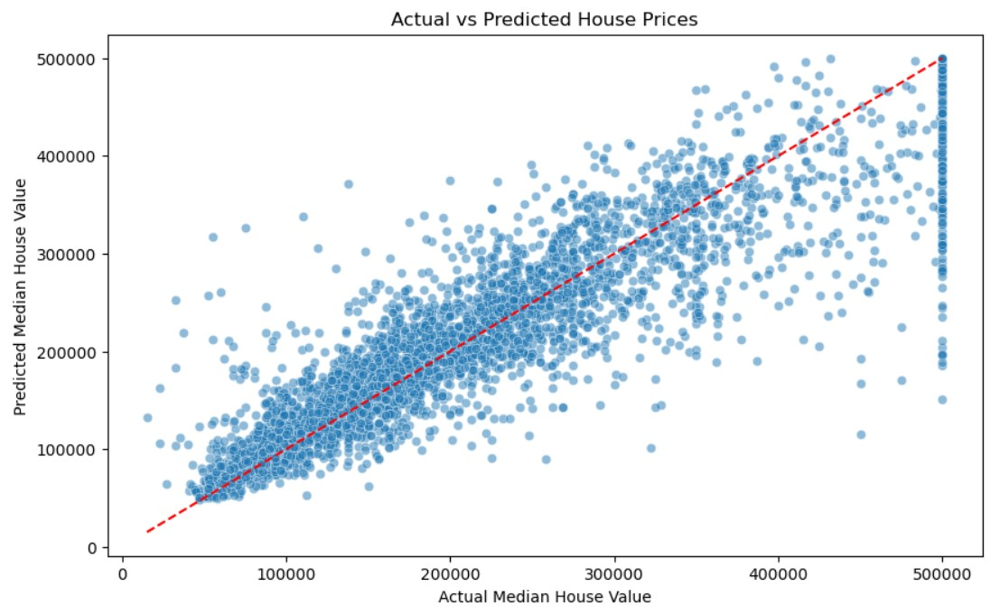

# House Pricing Prediction

## Overview

This project explores the California housing dataset to build predictive models for median house values. It aims to understand the data characteristics, perform feature engineering, and apply regression models, including Linear Regression and Random Forest, to predict house prices accurately.

The project includes detailed exploratory data analysis (EDA), model training, evaluation, and interpretation of results with relevant visualisations.

---

## Project Goals

- Explore the housing dataset to uncover key patterns and correlations.  
- Engineer meaningful features to improve model performance.  
- Build and compare regression models to predict median house prices.  
- Evaluate models with appropriate metrics and visualise prediction accuracy.  
- Analyse feature importance to interpret model drivers.

---

## Tools Used

- **Python** for data processing and modelling.  
- **Pandas** for data manipulation and cleaning.  
- **NumPy** for numerical operations.  
- **Matplotlib & Seaborn** for data visualisation.  
- **Scikit-learn** for machine learning modelling and evaluation.  
- **Jupyter Notebooks** to organise code, outputs, and explanations.

---

## Data Exploration and Analysis

You can view the full notebook for this section here: [1_Data_Exploration_and_Analysis.ipynb](1_Data_Exploration_and_Analysis.ipynb)

The dataset contains over 20,000 records with features including geographic coordinates, housing attributes, demographics, and median income. Initial steps included:

- Loading the dataset and dropping missing values.  
- Visualising distributions of key variables via histograms.  
- Computing and visualising feature correlations through heatmaps.  
- Applying log transformations to reduce skewness on certain features (`total_rooms`, `total_bedrooms`, `population`, and `households`).  
- Encoding categorical variable `ocean_proximity` via one-hot encoding.  
- Creating new ratio features like `bedroom_ratio` and `household_rooms` for better model inputs.

### Visualisations

- Histograms of original and log-transformed features.  
    
  

- Correlation heatmaps before and after transformation and encoding.  
    
  

- Scatterplot of house prices by geographical coordinates with colour representing price intensity.  
  

---

## Regression Models

You can view the full notebook for this section here: [2_Regression_Models.ipynb](2_Regression_Models.ipynb)

### Linear Regression

- Data was standardised using `StandardScaler`.  
- Linear regression was fit on scaled training data.  
- Model achieved an R² score of approximately **0.67** on the test set.

### Random Forest Regressor

- Trained on the same scaled features.  
- Achieved improved performance with an R² score around **0.81** on the test set.

### Hyperparameter Tuning

- Grid Search with cross-validation was performed to optimise Random Forest parameters (`n_estimators`, `min_samples_split`, `max_depth`).  
- The best model achieved an R² score of **~0.80** on the test set.

---

## Model Evaluation and Insights

**Actual vs Predicted Prices:**  
- Scatter plot comparing actual median house values to predicted values to visualise model accuracy.  

    

- The scatter plot shows that the predicted median house values closely follow the actual prices, indicating the model performs reasonably well overall. Most points are near the diagonal reference line, meaning predictions are generally accurate and not too far off from the true values.

**Residual Analysis:**  
- Residual plot showing prediction errors across predicted values.  

    

- Distribution plot of residuals to check error normality and variance.  

    

- The residual plot shows a mostly random scatter of points around the zero red reference line. While there is no strong obvious pattern, some slight clustering can be observed, suggesting minor model bias in certain value ranges.  
- The distribution of residuals appears approximately normal, indicating that the model’s prediction errors are symmetrically distributed with no heavy skew, supporting the assumption of homoscedasticity and confirming the model's reliability.

**Feature Importance:**  
- Bar plot illustrating the relative importance of features in the Random Forest model.

    

- The Random Forest feature importance plot highlights `median_income` as the most influential predictor, with an importance score close to 0.5. This suggests household income is the strongest driver of housing prices in this dataset.  
- Geographic features such as `INLAND` (one-hot encoded), `longitude`, and `latitude` follow, each with importance scores around 0.1, indicating location is a significant factor in price variation.  
- Additionally, `housing_median_age` contributes moderately with a score of approximately 0.05, showing that the age of the housing stock has some influence on pricing but is less critical compared to income and location factors.

---

## What I Learned

- Log-transforming skewed variables helped improve feature distribution and model performance.  
- Encoding categorical features and creating ratio features enhanced model input relevance.  
- Random Forest significantly outperformed Linear Regression on this dataset.  
- Hyperparameter tuning is crucial for optimising model accuracy.  
- Visualisation is key for diagnosing model behaviour and understanding feature effects.

---
